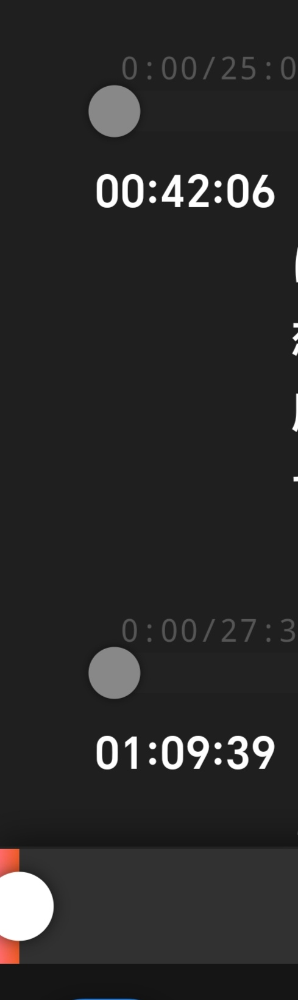
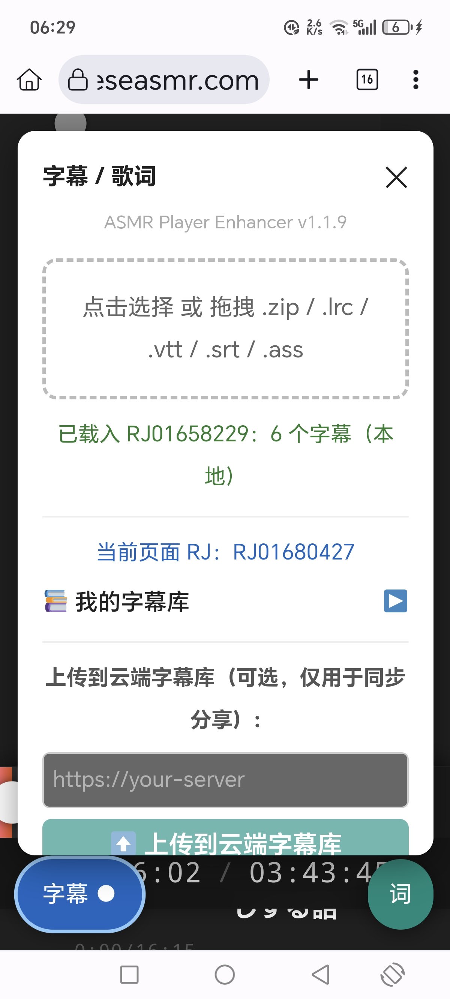

# japaneseasmr-better-bar

增强 [japaneseasmr.com](https://japaneseasmr.com) 音频播放器的 Chrome 浏览器扩展（Manifest V3）。

## 打包下载（zip）

各版本打包位于仓库根目录，命名 `ASM-Player-Enhancer-vX.Y.Z.zip`，点击即可下载：

- 最新：[ASM-Player-Enhancer-v1.1.9.zip](ASM-Player-Enhancer-v1.1.9.zip)
- 历史：[ASM-Player-Enhancer-v1.1.0.zip](ASM-Player-Enhancer-v1.1.0.zip) ~ [ASM-Player-Enhancer-v1.1.8.zip](ASM-Player-Enhancer-v1.1.8.zip)（仓库根目录 [./](./) 均有留存）

安装时解压后加载其中的 `asmr-player-enhancer` 文件夹即可。

## 截图

> 注：截图中面板里的「字幕库服务器 / 上传到云端字幕库」为**占位 UI，图中所示的服务端功能当前并未实现**，请勿填写服务器地址。字幕实际保存在浏览器 localStorage（本地），正常工作。





## 功能

### 播放器增强（v1.x）
- **全宽悬浮进度条**：固定在屏幕下方 30% 位置，可拖动快进/快退。
- **已播放时间显示**：`HH:MM:SS / HH:MM:SS`（原站仅显示剩余时间）。
- **每 Track 独立进度条**：在 `#plyr-chapter-playlist` 每个音轨下方注入独立进度条，显示 `已播放/总时长`，当前音轨高亮。
- **长按防误触**：触摸需按住 300ms 才激活拖动，快速滑动不触发（避免上下浏览网页时误触）。

### 字幕 / 歌词模块（v1.1.0）
- 左下角「字幕」按钮打开面板，支持加载 **字幕压缩包（.zip）** 或单个 **.lrc / .vtt / .srt / .ass**（点击或拖拽）。
- 按 Track 标题自动匹配字幕文件（类似 asmr.one 的单/多音声字幕上传）。
- 浮动同步歌词框，当前行高亮、前后句灰显、自动滚动；右下「词」按钮可单独开关歌词浮窗。
- 字幕库以浏览器 **localStorage 本地存储** 为准：拖入/上传的字幕自动按 RJ 号记录，刷新或重开浏览器仍在，无需任何服务器。
- ⚠️ 面板里的「字幕库服务器 / 上传到云端字幕库」为**占位项，当前没有对应服务端，请勿填写**（详见下方截图说明）。

## 安装
1. 下载 `ASMR-Player-Enhancer-v1.1.0.zip` 并解压。
2. Chrome → `chrome://extensions` → 开启「开发者模式」→「加载已解压的扩展程序」。
3. 选择解压后的 `asmr-player-enhancer` 文件夹。
4. 访问 japaneseasmr.com 任意作品页即可生效。

## 目录结构
```
asmr-player-enhancer/
├── manifest.json      # Manifest V3
├── content.js         # 播放器增强（进度条 / Track 进度条）
├── subtitles.js       # 字幕压缩包加载 + 同步歌词框
├── content.css        # 样式
├── jszip.min.js       # JSZip v3.10.1 (MIT)，内置 zip 解析
├── icons/             # 扩展图标
├── Screenshot_*.jpg   # 效果截图（见上方）
├── README.md          # 本文件
└── PRD.md             # 开发文档
```
